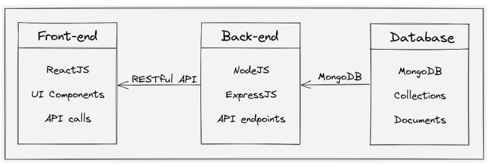

# 🚀 StudyNotion – Full Stack EdTech Platform (MERN)

> A production-grade EdTech platform built using the MERN stack with authentication, payments, cloud storage, and scalable architecture.

---

## 🌐 Live Demo

- 🔗 Frontend: https://study-notion-sooty-phi.vercel.app  
- 🔗 Backend API: https://studynotion-backend-882z.onrender.com/api/v1  

---

## 📸 Project Preview

### 🏠 Main Page


---

### 🧠 System Architecture


---

### 🗄️ Database Schema


---

## ⚡ Key Features

- 🔐 JWT Authentication (Login / Signup)
- 👨‍🎓 Role-based system (Student / Instructor)
- 📚 Course creation & management
- 🎥 Video-based learning system
- 💳 Razorpay payment integration
- ⭐ Course rating & review system
- 📊 Instructor dashboard with analytics
- ☁️ Cloudinary media storage

---

## 🧠 System Architecture

Frontend (React + Redux) → Vercel  
Backend (Node + Express) → Render  
Database (MongoDB Atlas) → Cloud DB  
Media Storage (Cloudinary) → Cloud Assets  
Payments (Razorpay) → Secure Gateway  

---

## 🛠 Tech Stack

### Frontend
- React.js (v18)
- Redux Toolkit
- Tailwind CSS
- Axios
- React Router DOM

### Backend
- Node.js
- Express.js
- MongoDB + Mongoose
- JWT Authentication
- Bcrypt.js
- Nodemailer

### DevOps
- Vercel (Frontend)
- Render (Backend)
- MongoDB Atlas
- Cloudinary

---

## 📁 Project Structure

```txt id="structurefinal"
StudyNotion/
│
├── src/              # Frontend
├── server/           # Backend
│   ├── controllers/
│   ├── routes/
│   ├── models/
│   ├── middlewares/
│   └── utils/
│
├── public/
├── images/
└── package.json


⚙️ Environment Variables

Backend

PORT=4000
MONGODB_URL=your_mongodb_url
JWT_SECRET=your_secret
RAZORPAY_KEY=your_key
RAZORPAY_SECRET=your_secret
CLOUD_NAME=your_cloud_name
API_KEY=your_api_key
API_SECRET=your_api_secret

Frontend

REACT_APP_BASE_URL=https://studynotion-backend-882z.onrender.com/api/v1
REACT_APP_RAZORPAY_KEY=your_key

🚀 Local Setup

git clone https://github.com/priyESH88088/StudyNotion.git
npm install
cd server && npm install
npm run dev


🏆 Project Highlights

Production-level full stack deployment
Clean and scalable backend architecture
Secure authentication system (JWT)
Payment gateway integration (Razorpay)
Cloud-based media handling (Cloudinary)
Role-based access system
Real-world REST API design


👨‍💻 Developer

Priyesh Dwivedi
GitHub: https://github.com/priyESH88088

⭐ Final Note

This project demonstrates a real-world full stack application with production deployment, scalable architecture, and modern web development practices.
